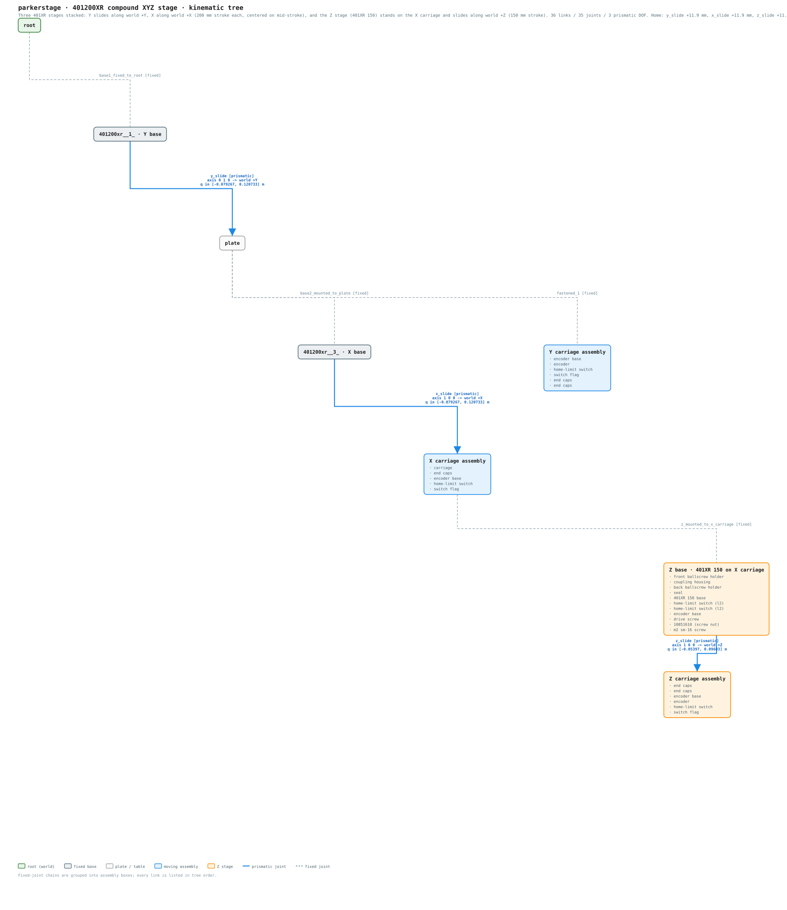
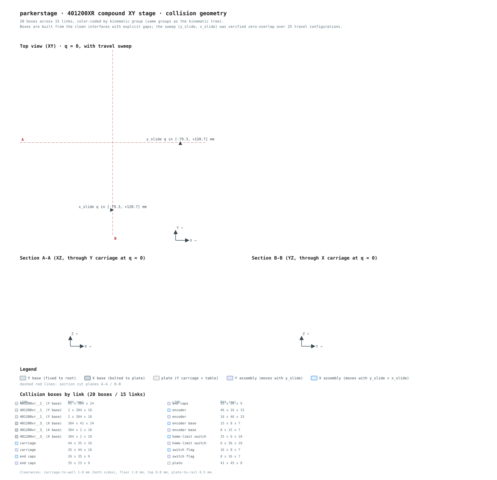

# parkerstage

URDF and ROS package for a **Parker 401200XR/401XR150 compound XYZ linear
stage** — two identical 401XR ballscrew-driven stages stacked perpendicular,
200 mm stroke each, plus a 401XR **150** (150 mm stroke) standing vertically at
the **centre of the assembly as a fixed column**. The bottom stage travels
along **+Y**; the middle stage (mounted on the bottom carriage's table)
travels along **+X**; the Z column is bolted to the world at the assembly
centre — independent of the XY motion — and its carriage travels along **+Z**
(up/down).

The model is derived from two Onshape exports (kept as
`urdf/parkerstage.urdf.onshape` and `urdf/zslide.urdf.onshape`) and rebuilt
into a clean, simulation-ready URDF with three usable slide joints, box
collision geometry, and mesh-derived aluminum inertials.

## Package layout

```
parkerstage/
├── package.xml            # catkin package manifest (ROS 1, format 2)
├── CMakeLists.txt         # data-only catkin package (install rule for launch/urdf/meshes)
├── launch/
│   └── parkerstage.launch # robot_state_publisher + joint_state_publisher_gui + rviz
├── urdf/
│   ├── parkerstage.urdf       # generated model (do not hand-edit)
│   ├── parkerstage.urdf.onshape  # original XY Onshape export (source of truth)
│   └── zslide.urdf.onshape    # original Z (401XR150) Onshape export
├── meshes/                # 27 STL files, referenced via package://parkerstage/meshes/...
├── docs/
│   ├── kinematic_tree.svg     # kinematic tree diagram (generated, see below)
│   └── collision_geometry.svg # collision boxes + travel sweep (generated, see below)
└── tools/                 # Python scripts (see "Regenerating assets" below)
```

## Model diagram



**Kinematic tree** — links as boxes, joints as labeled edges. Chains of fixed
joints are grouped into assembly boxes (every link is still listed, in tree
order) so the three prismatic slide joints — the only movable DOF — stand out.
The Z stage is its own orange branch off `root` (`root → Z base → Z assembly`,
split by `z_slide`), independent of the XY chain. Regenerate with
`python3 tools/make_tree_svg.py`.



**Collision geometry** — the 30 collision boxes (color-coded by kinematic
group, Z stage in orange) in a top view with the slide travel sweep, plus
channel cross-sections A-A / B-B showing the clearances (kept focused on the
XY carriages; the tall Z column is shown in the top view), and a per-link box
inventory. Regenerate with `python3 tools/make_collision_svg.py`.

## URDF model

- **36 links / 35 joints**, rooted at `root` (fixed to the world).
- **`y_slide`** — prismatic, axis `0 1 0` (world +Y), drives the bottom
  carriage, table, and the entire middle + Z stage.
- **`x_slide`** — prismatic, axis `1 0 0` (world +X), drives the top carriage
  group and the Z stage mounted on it.
- **`z_slide`** — prismatic, axis `1 0 0` in the Z base frame (world +Z),
  drives the Z carriage group up and down. The Z base is **fixed to `root`**
  at the assembly centre: it does not move with `y_slide` or `x_slide` — the
  XY stages sweep beneath the column (its base end floats ~2 mm above the
  tallest swept feature, the X-base rails).
- **Limits** are centered on the physical mid-stroke, not the CAD zero
  configuration: `y_slide` and `x_slide` are `[-0.0793, +0.1207]` m about
  `q = +0.0207` (200 mm stroke); `z_slide` is `[-0.0540, +0.0960]` m about
  `q = +0.0210` (150 mm stroke). The home-limit switches trip at **+11.9 mm**
  on all three stages (flag centered on switch) — inside the travel range.
- **Collisions:** 30 boxes across 23 links, built from the clean interfaces
  with explicit gaps (the raw CAD interpenetrates in several places). Verified
  zero overlaps across 125 travel configurations (5×5×5 grid).
- **Inertials:** computed by voxelizing the STLs at 1 mm resolution with
  aluminum density (2700 kg/m³). Total mass ≈ 2.0 kg (Z stage adds ≈ 0.86 kg).
  *Excludes the ballscrew, motor, bearings, and fasteners not present in the
  meshes.*

## Requirements

- **ROS 1** (Noetic or Melodic) with `robot_state_publisher`,
  `joint_state_publisher_gui`, `tf2_ros`, and `rviz` installed.
- Python 3 (stdlib only) for the `tools/` scripts.

## Build

The package is ROS 1, so it works with both `catkin_make` and `colcon build`
(catkin build type) in a ROS 1 workspace:

```bash
# workspace setup
mkdir -p ~/catkin_ws/src
cd ~/catkin_ws/src
git clone https://github.com/TacHuynh/parkerstage.git
cd ~/catkin_ws

# either:
catkin_make
# or:
colcon build
```

Then source the workspace:

```bash
source ~/catkin_ws/devel/setup.bash    # catkin_make
source ~/catkin_ws/install/setup.bash  # colcon build
```

This is a **ROS 1** package; the launch file uses ROS 1 syntax (`$(find …)`,
`textfile` params, `joint_state_publisher_gui`) and will not work under ROS 2.

## Run

```bash
roslaunch parkerstage parkerstage.launch
```

This brings up:

- `robot_state_publisher` — publishes TF from the joint states
  (`robot_description` loaded from `urdf/parkerstage.urdf` via
  `$(find parkerstage)`).
- `joint_state_publisher_gui` — sliders for `y_slide`, `x_slide` and
  `z_slide` (`[-0.0793, 0.1207]` m for Y/X, `[-0.0540, 0.0960]` m for Z).
- a `map → root` static transform, and `rviz`.

The URDF resolves its meshes through `package://parkerstage/meshes/...`, which
works in both the devel space (symlinked share dir) and the install space (the
`CMakeLists.txt` install rule copies `launch/`, `urdf/`, and `meshes/` into
`share/parkerstage/`).

### Gazebo / MuJoCo

The `<collision>` boxes and `<inertial>` blocks make the model usable in both
simulators as-is (e.g. `spawn_urdf_model` in Gazebo, or by converting the URDF
to MJCF with `mujoco`'s URDF loader). See the caveats below.

## Regenerating assets

The URDF is generated, not hand-maintained. From the repo root:

```bash
python3 tools/rebuild_urdf.py
```

Reads `urdf/parkerstage.urdf.onshape`, rebuilds the clean joint tree, recomputes
inertials and collision boxes, writes `urdf/parkerstage.urdf`, and runs the
verification suite:

- every link's 4×4 world transform matches the original exports to < 5e-6
  (geometry unchanged);
- slide axes verified: `y_slide` → world +Y, `x_slide` → world +X,
  `z_slide` → world +Z;
- stroke guards: both XY slides 200.0 mm, Z slide 150.0 mm (Parker spec);
- mid-stroke guards: limits centred on the physical mid-stroke recomputed from
  the mesh bboxes (Y/X `+0.020733` m, Z `+0.021030` m);
- home guards: `q_home` recomputed from the switch/flag meshes stays at
  `+11.9` mm inside travel for all three stages;
- collision sweep: all box pairs × 125 travel configs, zero overlaps.

Standalone browser preview (no ROS needed):

```bash
python3 tools/make_viewer.py     # writes viewer.html (gitignored build artifact)
open viewer.html                 # sliders drive all three slides; yellow wireframes = collision boxes
```

The viewer supports a link filter via URL hash (e.g. `viewer.html#401200xr`)
and view-preset buttons for inspecting individual parts.

### Other analysis scripts

| script | purpose |
|---|---|
| `tools/analyze_urdf.py` | kinematic tree, world poses and world-space bounding boxes at q=0 |
| `tools/home_offset.py` | computes mid-stroke and home-limit switch positions from mesh geometry |
| `tools/analyze_collision.py` | voxel cross-sections and interpenetration analysis of the CAD |
| `tools/mesh_inertia.py` | volume / COM / inertia tensor from STL (voxel fill, shell-mesh safe) |
| `tools/make_tree_svg.py` | generates `docs/kinematic_tree.svg` from the URDF |
| `tools/make_collision_svg.py` | generates `docs/collision_geometry.svg` (boxes, sweep, sections) |

## Caveats

- **Inertials are mesh-only:** they omit the ballscrew, bearings, motor, and
  fasteners, so the real stage (≈3–4 kg with drives) is heavier than the
  2.0 kg model, mostly in the bases.
- **Collision boxes are idealized:** the smallest clearances are 0.2–0.5 mm
  (accessory-to-wall, plate-to-rail). They are built from clean interfaces
  because the CAD export itself interpenetrates (~4 cm³ carriage-in-base,
  plate-in-flange, etc.).
- **Export quirks:** the X-stage export is missing its −y end cap, and `root`
  carries a stray end-cap visual (kept, harmless). Onshape computed the part
  COMs correctly but with bogus densities — that is what `rebuild_urdf.py`
  fixes. The Z export carries a second home-limit switch (L2) on the base
  group; only the L1 switch on the carriage is used for the home measurement.
- **X-carriage flip:** the raw export had the X-stage carriage mounted as a
  180° mirror of the Y-stage carriage (encoder/readhead toward base −x and
  home-limit switch/flag toward base +x). `rebuild_urdf.py` rotates the whole
  X carriage subtree 180° about the vertical axis through its mount so it is
  posed exactly like the Y carriage (encoder toward base +x, switch/flag
  toward base −x); carriage stays upright and travel still follows world +X.
  The collision boxes and the two doc SVGs are regenerated to match.
- **Z mount:** the Z stage is a **fixed column** bolted to the world at the
  assembly centre (its footprint centred on the X carriage mid position),
  standing on its −z end with the motor on top and the carriage hanging on the
  −y side. It does not move with the XY slides — the X base and rails sweep
  beneath it, with the column's base end floated ~2 mm above the tallest swept
  feature. `z_slide`'s local axis `1 0 0` maps to world +Z through the mount
  rotation.
- **License placeholder:** `package.xml` declares BSD-3-Clause; update the
  maintainer email and license to your own before redistributing.
